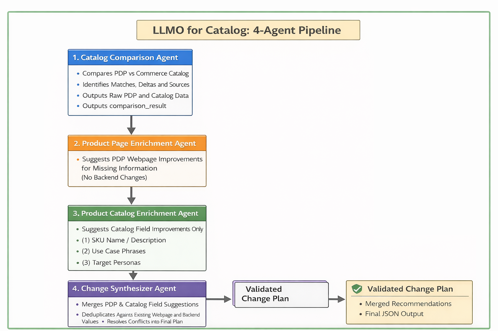

# LLMO for Catalog POC

This project is a POC to illustrate the critical steps (Steps 2 & 3) in the flow for LLMO for catalog (The High Level Design of the entire flow is [here](https://wiki.corp.adobe.com/display/EntComm/High+Level+Design%3A+LLM+Optimizer+for+Catalog)). The POC implements a **multi-agent catalog intelligence pipeline** using [crewAI](https://crewai.com).  
It is designed to **analyze, compare, and enrich product detail pages (PDPs)** by combining:

- **What is actually rendered on the webpage** (human-visible content and embedded metadata)
- **What exists in the Adobe Commerce backend** (the complete, authoritative catalog truth per SKU)
- **AI intelligence for further user-intent enrichment and SEO optimization**

The system produces **actionable, structured recommendations** to improve:

- **Product facts completeness** (attributes, variants, facets)
- **Shopper intent clarity** (use context, target personas)
- **SEO-critical human-visible content** (title tag, meta description, H1)

All outputs are **machine-readable JSON**, suitable for **automation, validation, and downstream publishing workflows**.

---

## What This Project Does

Given a **product detail page URL**, the crew performs the following steps:

1. **Scrape the webpage** to extract:
    **Note: the POC writes a scraper tool to scrape the webpage by itself since it does not connect to LLMO Spacecat. But in real production/release, the scraper should be from the LLMO (Spacecat Project scrapers - if its existing scrapers do not scrape all neccessary inforamtion from a PDP, updates/addition are needed.)**
   - Visible content (title, description, images, price)
   - Embedded metadata (JSON-LD, breadcrumbs, SKU)
   - SEO signals (H1, `<title>`, meta description, canonical URL)

2. **Fetch backend catalog data** from Adobe Commerce using the SKU:
   - Full product attributes
   - Options and variants
   - Pricing and inventory
   - Raw catalog payloads (fully preserved)

3. **Compare webpage data with backend data** to identify:
   - Missing or incomplete product facts
   - Inconsistencies between sources
   - Catalog information not surfaced on the PDP

4. **Generate structured enrichment proposals** across three dimensions:
   - **Product facts** (attributes, variants, facets)
   - **Shopper intent** (use context, target personas)
   - **SEO-visible content** (title tag, meta description, H1)

5. **Synthesize a final, validated change plan** that can be:
   - Reviewed by humans
   - Applied programmatically
   - Integrated with AEM or storefront publishing pipelines

---

## Architecture Overview of the POC

### Agents (4-Agent Pipeline)




| Agent | Responsibility |
|------|----------------|
| **catalog_comparison_agent** | Scrapes the PDP, fetches Commerce backend data for the extracted SKU (including attributes, category, variants, and variant-based price ranges), and produces a structured comparison. The output MUST include `raw_sources.webpage` and `raw_sources.backend`, and treat backend as the source of truth in conflicts. |
| **product_page_enrichment_agent** | Produces ONE consolidated PDP **webpage-only** enrichment proposal for the delta information missing/weak on the PDP but available in the Commerce catalog (e.g., attributes/specs/material/dimensions/certifications, category path, variants summary, variant-based price range surfacing). **Does not** propose shopper intent fields anymore. |
| **product_catalog_enrichment_agent** | Proposes **Commerce catalog backend** enrichment for SEO/content-managed fields (e.g., catalog-managed title/description/H1 equivalents) and **also** proposes intent fields to store in catalog: `intent.use_context` and `intent.target_personas`. |
| **change_synthesizer_agent** | Merges outputs from enrichment agents into a final, conflict-resolved change plan, and de-duplicates suggestions that are identical or near-duplicates of existing current values found in `raw_sources.webpage` or `raw_sources.backend`. |

All enrichment agents output **strict JSON** with the following structure:

- `suggested_changes`: key-value pairs describing what should be added or updated  
- `explanations`: per-field justification, source, evidence, and implementation notes  
 

---

## Key Tools

### commerce_pdp_scraper

Scrapes the product detail page itself (webpage source of truth):

- HTML content
- JSON-LD Product blocks
- H1, title tag, meta description
- Breadcrumbs
- Images and price
- Extracts and normalizes SKU (`normalized_sku`)

This tool represents **what a human shopper and search engine can see**.

### commerce_product_data_by_sku

Fetches backend catalog truth via Adobe Commerce MCP:

- Calls `productData` and `productVariants`
- Retrieves attributes, options, variants, and pricing
- Preserves **all raw backend fields**
- Produces a normalized but complete structure for agents

This tool represents **authoritative catalog truth per SKU**.

---

## Installation

### Requirements

- **Python >= 3.10 and < 3.14**
- An **OpenAI-compatible LLM API key** (used by crewAI)

### Install Dependencies

This project uses [UV](https://docs.astral.sh/uv/) for dependency management.

```bash
pip install uv
crewai install
```

### Environment Setup

Create a `.env` file in the project root:

```env
MODEL=your_selected_model
AZURE_API_KEY=your_api_key
AZURE_API_BASE=your_api_base
AZURE_API_VERSION=your_api_version

# ---------- Optional default logging level ----
LOG_LEVEL=INFO
CREWAI_TRACING_ENABLED=true
```

---

## Configuration

You can customize the system by editing:

- `src/llmo_for_catalog/config/agents.yaml`  
  Defines agent roles, goals, constraints, and reasoning behavior.

- `src/llmo_for_catalog/config/tasks.yaml`  
  Defines deterministic task inputs, outputs, and dependencies.

- `src/llmo_for_catalog/crew.py`  
  Wires agents, tools, and execution order.

- `src/llmo_for_catalog/main.py`  
  Controls runtime inputs and CLI behavior.

---

## Running the Crew

### Run Locally with a PDP URL

```bash
crewai run
```

The final synthesized output will be written to:

```
suggestions_and_explanations.json
```

---

## Output Guarantees

- No narrative prose in enrichment agents  
- Strict JSON schemas suitable for automation  
- Backend data is treated as authoritative  
- Webpage content is treated as search-visible truth  
- All raw data is preserved for auditability and debugging  
